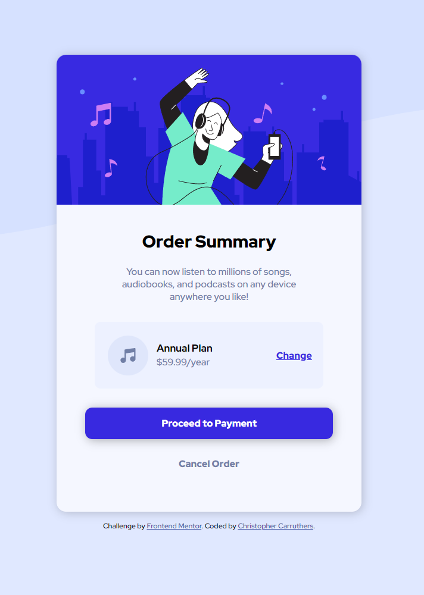

# Frontend Mentor - Order summary card solution

This is a solution to the [Order summary card challenge on Frontend Mentor](https://www.frontendmentor.io/challenges/order-summary-component-QlPmajDUj). Frontend Mentor challenges help you improve your coding skills by building realistic projects.

## Table of contents

- [Overview](#overview)
  - [The challenge](#the-challenge)
  - [Screenshot](#screenshot)
  - [Links](#links)
  - [Built with](#built-with)
  - [What I learned](#what-i-learned)
- [Author](#author)
- [Acknowledgments](#acknowledgments)

## Overview

### The challenge

Users should be able to:

- See hover states for interactive elements

### Screenshot

### Links

- Solution URL: [To be added](https://your-solution-url.com)
- Live Site URL: [To be added](https://your-live-site-url.com)

### Built with

- Microsoft Edge
- VS Code
- Semantic HTML5 markup
- CSS custom properties
- Media Queries
- Flexbox
- Mobile-first workflow

### What I learned

This challenge I learned how to use media queries to make the website dynamic and scale with the resoloution of the device in which the user is using. The geal is to try and see if I can use pure CSS without queries to achieve the same result (may be possible, may not be. Not too sure).

## Author

- Website - [Christopher Carruthers](https://github.com/Chris971991)
- Frontend Mentor - [@carrumbum](https://www.frontendmentor.io/profile/carrumbum)

## Acknowledgments

I would like to put a word out for all the devs at Front End Mentor and thank them for creating a platform for people who want a challenge whilst learning Web Developement.
